# 青豆面板 (Qingdou Panel)


一个**本地运行、绿色可移动**的任务调度面板，对标青龙面板 / 呆呆面板，主打**轻量、省内存、依赖齐全、可对接 AI**。

> 同一份代码可在 **Windows / Linux / macOS** 服务器上直接运行，整目录复制即用，无硬编码路径。

---

## 目录

1. [特性一览](#特性一览)
2. [快速开始](#快速开始)
3. [界面截图](#界面截图)
4. [功能模块详解](#功能模块详解)
5. [微信对接 (yyb-go)](#微信对接-yyb-go)
6. [备份与恢复](#备份与恢复)
7. [GitHub 自动更新](#github-自动更新)
8. [开放 API](#开放-api)
9. [系统架构](#系统架构)
10. [目录结构](#目录结构)
11. [性能与内存优化](#性能与内存优化)
12. [常见问题](#常见问题)

---

## 特性一览

| 功能 | 说明 |
|------|------|
| ⏰ 定时任务 | 标准 5 段 crontab 表达式，支持 `python` / `node` / `bash` / `task xxx.py` / 任意 shell 命令 |
| 📜 脚本管理 | 内置文件管理器，在线创建 / 编辑 / 删除 / 运行 `.py` `.js` `.sh` 脚本 |
| 🔗 订阅管理 | 支持 **Git 仓库** 与 **青龙格式 JSON 清单** 自动同步，按脚本内 `# cron:` 注释自动建任务 |
| 📦 依赖安装 | 后台执行 `pip` / `npm` / `apt`，不阻塞面板，带安装日志 |
| 🔐 环境变量 | 所有启用变量在执行时注入子进程环境 |
| 🔔 通知推送 | pushplus / Server酱 / Bark / Telegram / 企业微信 / 钉钉 / 自定义 Webhook，任务结果自动推送 |
| 🤖 AI 对接 | 兼容 OpenAI / DeepSeek / 通义 / 本地 Ollama，支持对话、脚本生成、日志分析 |
| 💬 微信对接 | 独立「微信对接」页对接 yyb-go（应用宝扫码登录），查看连接状态与已登录微信账号 |
| 💾 备份与恢复 | 一键导出全部设置项（JSON）/ 导出数据库文件 / 导入恢复，便于迁移与回滚 |
| 🔄 GitHub 更新 | 填仓库地址后可「检查更新」「立即更新」（`git pull` + 自动重启），可开启每日自动更新 |
| 🎨 主题切换 | 支持暗色 / 明亮主题，登录页与后台均可一键切换 |
| 🔌 开放 API | 自带 Token（Bearer）REST API，含青龙兼容的 `/api/envs` `/api/crons`，可对接外部脚本 |
| 🖥 管理面板 | 暗色主题单页后台，仪表盘、任务、脚本、订阅、依赖、变量、通知、AI、微信对接、系统设置 |
| 💾 省内存 | 单进程 + SQLite(WAL) + 线程池限并发 + 日志流式写盘，默认仅占用几十 MB |
| 🐧 跨平台 | 同一套代码可在 **Windows / Linux / macOS** 服务器运行，启动脚本与执行引擎均做平台适配 |

---

## 快速开始

### Windows

```bat
双击 start.bat
```

首次运行会自动创建 `.venv` 并安装依赖，随后访问 http://127.0.0.1:5700

### Linux / macOS

```bash
chmod +x start.sh
./start.sh
```

### 手动运行

```bash
python -m venv .venv
.venv/bin/pip install -r requirements.txt
python app.py
```

默认账号：**admin / adminadmin**（登录后请尽快修改密码）。

---

## 界面截图

### 登录页

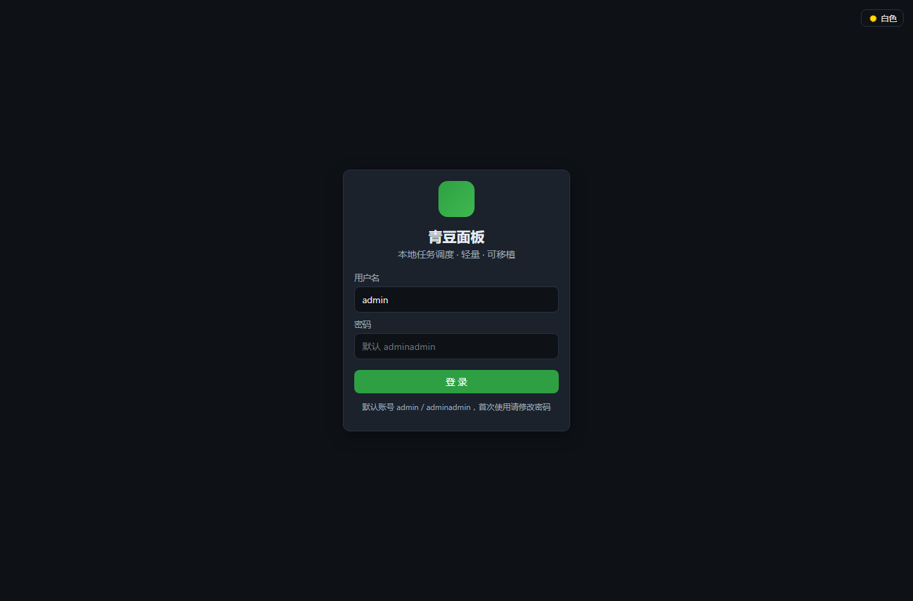

### 仪表盘

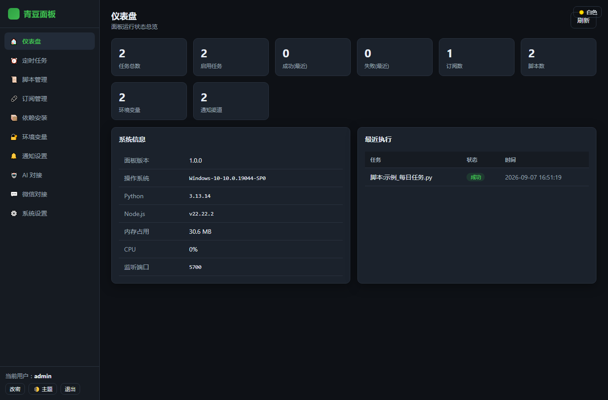

### 定时任务

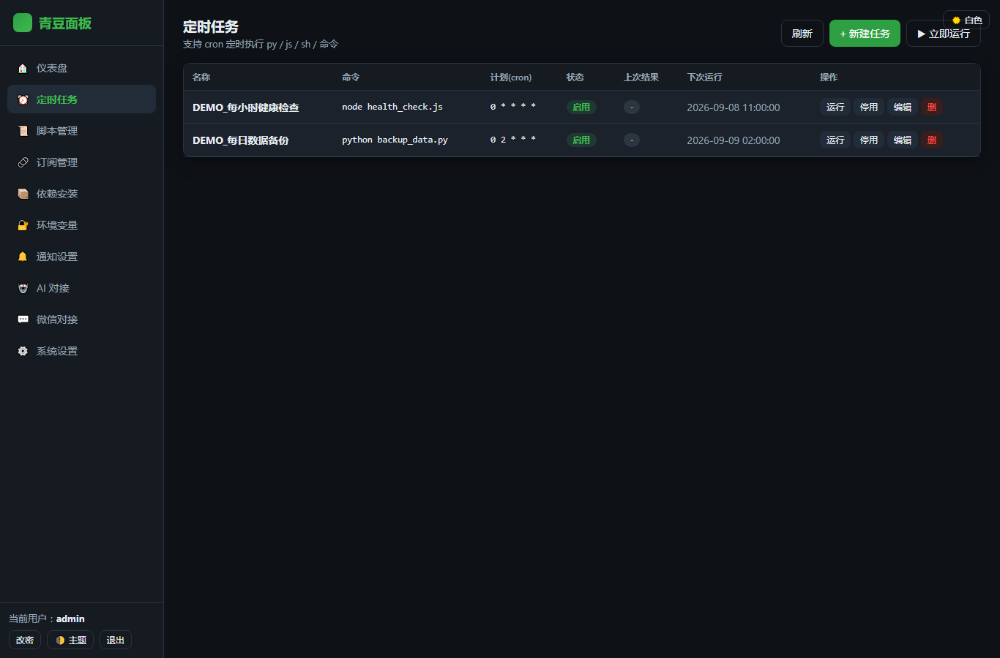

### 脚本管理

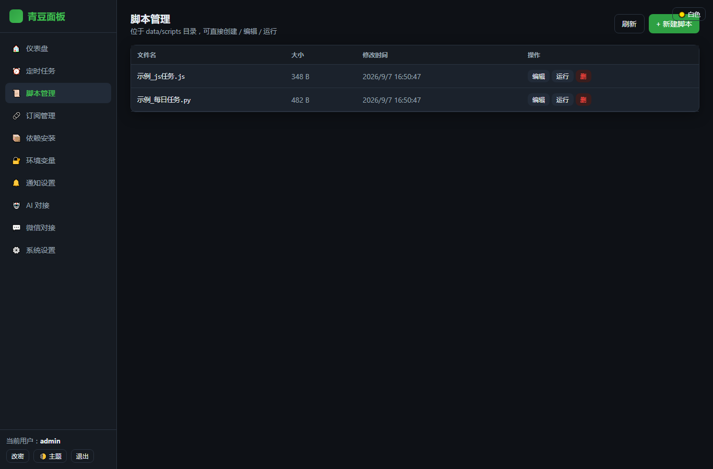

### 订阅管理

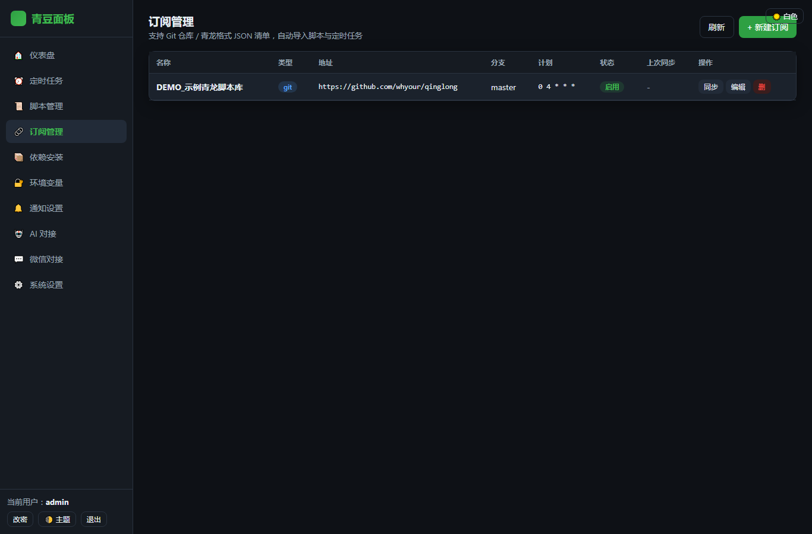

### 依赖安装

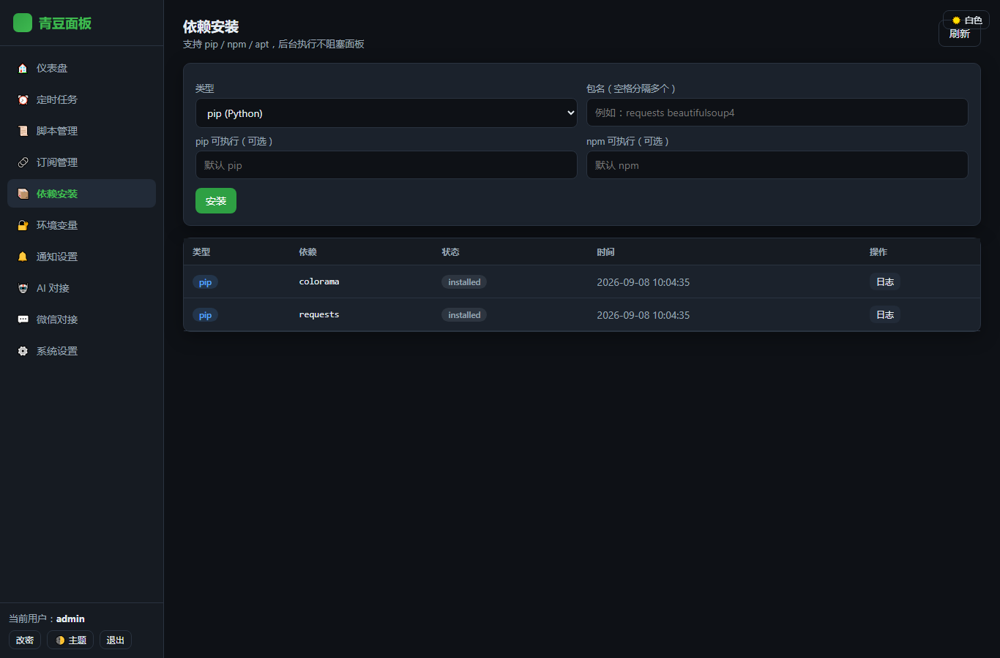

### 环境变量

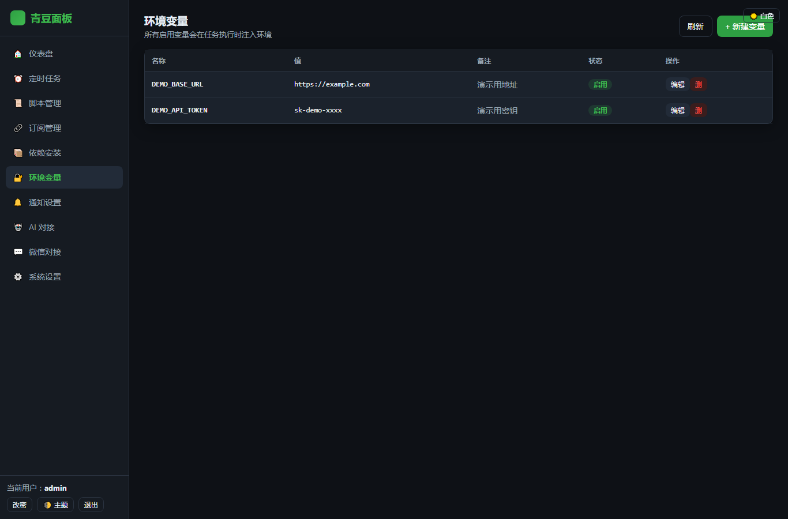

### 通知设置

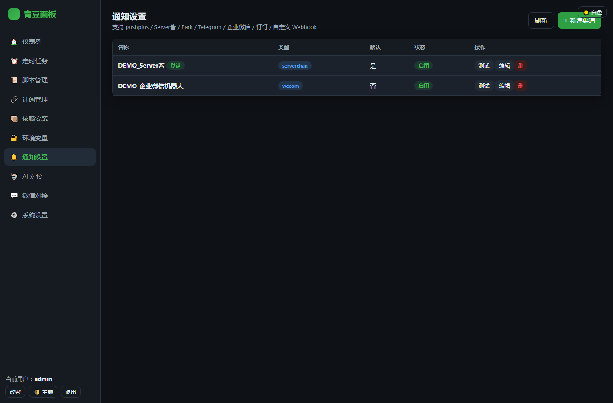

### AI 对接

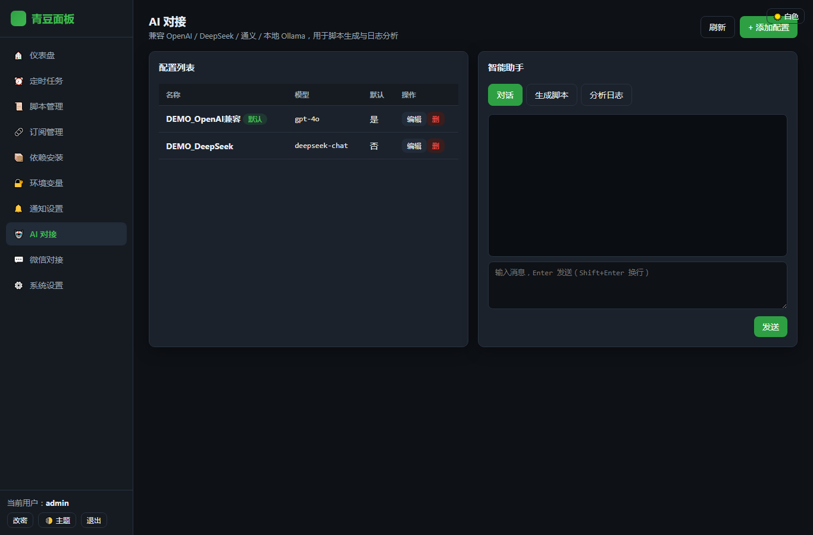

### 微信对接

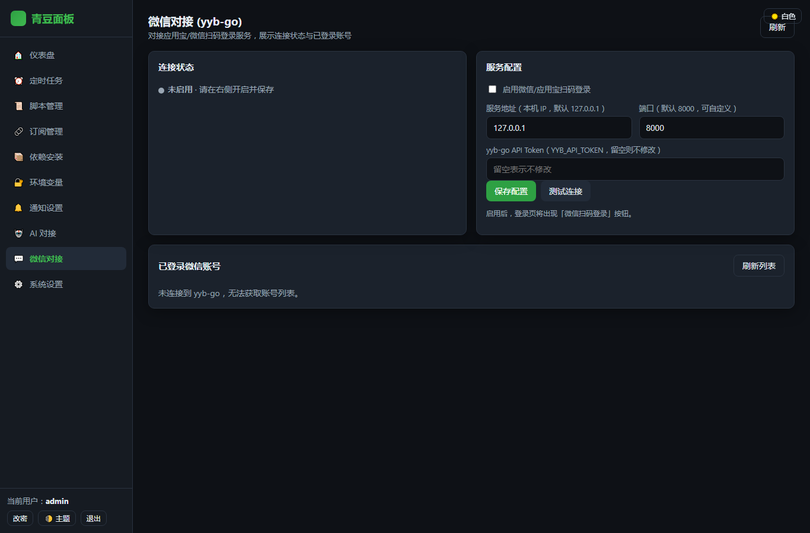

### 系统设置

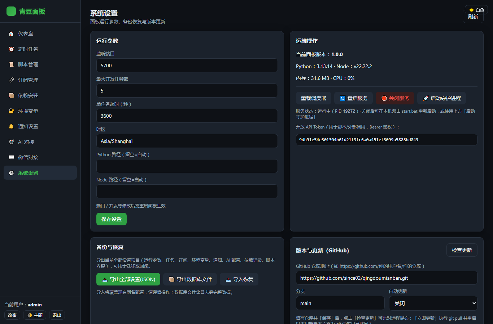

---

## 功能模块详解

### ⏰ 定时任务

- 支持标准 5 段 crontab 表达式，如 `0 4 * * *`（每天 04:00）。
- 命令可以是任意脚本：`python scripts/demo.py`、`node scripts/demo.js`、`bash scripts/demo.sh`。
- 支持 `task xxx.py` 语法，面板会自动补全解释器路径。
- 任务支持并发限制、超时控制、失败/成功通知。

### 📜 脚本管理

- 在线新建 / 编辑 / 删除 `.py` / `.js` / `.sh` 脚本。
- 脚本统一存放在 `data/scripts/` 目录，不污染源码。
- 支持一键运行，运行结果实时回显并记录日志。

### 🔗 订阅管理

- **Git 订阅**：填入仓库地址与分支，面板按 `cron` 定时 `git pull`。
- **青龙 JSON 订阅**：兼容青龙格式的脚本清单。
- 自动扫描脚本中的 `# cron:` / `// cron:` 注释，自动生成定时任务。

### 📦 依赖安装

- 支持 `pip install`、`npm install`、`apt install`。
- 后台执行，不阻塞前端。
- 每个依赖都有独立日志文件，便于排错。

### 🔐 环境变量

- 所有启用状态的环境变量会在任务执行时自动注入子进程环境。
- 青龙兼容接口 `/api/envs` 可直接读取/写入。

### 🔔 通知设置

支持 pushplus、Server酱、Bark、Telegram、企业微信机器人、钉钉机器人、自定义 Webhook。任务成功/失败均可按任务单独开启通知。

### 🤖 AI 对接

- 支持 OpenAI 兼容格式（OpenAI、DeepSeek、通义千问等）。
- 可配置多个 AI 配置，并指定默认项。
- 内置「脚本生成」入口，输入需求即可生成可直接运行的 Python/Node 脚本。

---

## 微信对接 (yyb-go)

左侧导航「微信对接」为独立设置页：

- **服务配置**：默认本机 IP `127.0.0.1`、端口 `8000`（yyb-go 默认），可自定义；填写 `YYB_API_TOKEN` 作为鉴权。
- **连接状态**：页面实时显示「已连接 / 未连接 / 未启用」圆点，并支持「测试连接」。
- **已登录微信账号**：连接正常时自动列出 yyb-go 中已登录的微信账号（昵称、状态、OpenID 片段），每 8 秒自动刷新。
- 启用后，登录页将出现「🟢 微信扫码登录」按钮，扫码确认即下发面板 Token。

> yyb-go 默认监听 `127.0.0.1:8000`，鉴权为 `Authorization: Bearer <YYB_API_TOKEN>`。详见 https://github.com/Aoluis1005/yyb-go

---

## 备份与恢复

在「系统设置 → 备份与恢复」中：

- **导出全部设置(JSON)**：导出运行参数、任务、订阅、环境变量、通知、AI 配置、依赖记录、脚本内容，用于迁移或回滚。
- **导出数据库文件**：直接下载 `qingdou.db`（含日志等完整数据）。
- **导入恢复**：上传备份 JSON，整表替换覆盖当前配置（脚本文件需另行拷贝 `data/scripts` 目录）。

> 提示：备份 JSON 不含真实 API Key、密码哈希等敏感字段？—— 会原样包含，请妥善保管备份文件。

---

## GitHub 自动更新

1. 将面板以 `git clone` 方式部署到服务器（需联网、已安装 git）。
2. 在「系统设置 → 版本与更新」填入你的 GitHub 仓库地址（如 `https://github.com/用户名/仓库.git`），选择分支。
3. 点击「检查更新」比对本地与远程提交；点击「立即更新」执行 `git pull` 并自动重启以应用新版本。
4. 可选开启「每日自动更新」：面板内置调度器会在每天 04:00 自动拉取并重启。

> 提示：更新前会先 `git stash` 本地改动，更新后如冲突请手动处理。

---

## 开放 API

面板内置 Token（Bearer）鉴权。Token 可在「系统设置」查看。

```bash
TOKEN=你的token

# 列出环境变量（青龙兼容）
curl -H "Authorization: Bearer $TOKEN" http://127.0.0.1:5700/api/envs

# 新增定时任务
curl -X POST -H "Authorization: Bearer $TOKEN" -H "Content-Type: application/json" \
  -d '{"name":"测试","command":"python scripts/demo.py","schedule":"0 9 * * *"}' \
  http://127.0.0.1:5700/api/crons

# 调用 AI 生成脚本
curl -X POST -H "Authorization: Bearer $TOKEN" -H "Content-Type: application/json" \
  -d '{"prompt":"写一个打印 hello 的 python 脚本"}' \
  http://127.0.0.1:5700/api/ai/generate_script
```

### 主要接口速查

| 功能 | 方法 | 路径 |
|------|------|------|
| 登录 | POST | `/api/login` |
| 仪表盘 | GET | `/api/system/info` |
| 任务列表 | GET | `/api/tasks` |
| 新增/修改任务 | POST | `/api/tasks` |
| 任务日志 | GET | `/api/logs?task_id=...` |
| 脚本列表 | GET | `/api/scripts` |
| 环境变量 | GET/POST | `/api/envs` |
| 青龙兼容环境变量 | GET/POST | `/api/envs` |
| 青龙兼容定时任务 | GET/POST | `/api/crons` |
| 订阅列表 | GET/POST | `/api/subscriptions` |
| 依赖列表 | GET/POST | `/api/dependencies` |
| 通知配置 | GET/POST | `/api/notifications` |
| AI 配置 | GET/POST | `/api/ai/configs` |
| 微信对接状态 | GET | `/api/yybgo/connection` |
| 微信扫码 QR | POST | `/api/yybgo/qr` |
| 备份 JSON | GET | `/api/system/backup` |
| 导入恢复 | POST | `/api/system/restore` |
| 检查更新 | GET | `/api/system/update/check` |
| 立即更新 | POST | `/api/system/update/do` |
| 重启面板 | POST | `/api/system/restart` |
| 关闭面板 | POST | `/api/system/stop` |

---

## 系统架构

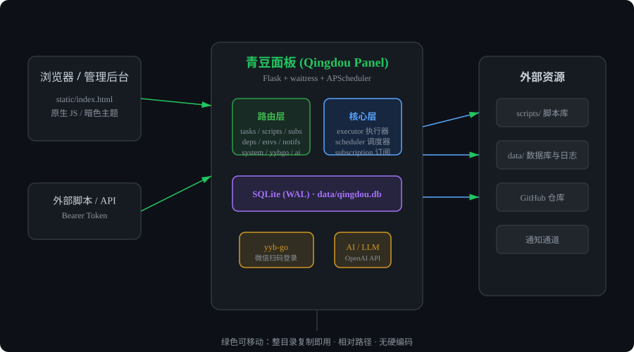

### 架构说明

- **浏览器 / 外部脚本**：通过 HTTP REST API 访问面板。
- **Flask + waitress**：作为 WSGI 服务，生产环境更稳定。
- **APScheduler**：负责任务调度，支持 cron 表达式。
- **Executor**：线程池执行脚本，日志流式写盘。
- **SQLite (WAL)**：轻量数据库，读写并发友好。
- **绿色可移动**：所有路径相对面板根目录解析，可复制到任意位置运行。

---

## 目录结构

```
qingdou-panel/
├── app.py                 # 入口（单进程 + waitress）
├── requirements.txt       # Python 依赖
├── start.bat              # Windows 一键启动
├── start.sh               # Linux/macOS 一键启动
├── README.md              # 本说明文档
├── LICENSE                # MIT 许可证
├── core/                  # 核心引擎
│   ├── db.py              # SQLite 封装（WAL 模式）
│   ├── config.py          # 配置 / 鉴权
│   ├── cron.py            # crontab 解析
│   ├── executor.py        # 脚本执行引擎
│   ├── scheduler.py       # APScheduler 调度
│   ├── subscription.py    # 订阅同步
│   ├── notifier.py        # 通知推送
│   └── ai.py              # AI 对接
├── routes/                # REST API 与青龙兼容接口
│   ├── auth.py
│   ├── tasks.py
│   ├── scripts.py
│   ├── envs.py
│   ├── subscriptions.py
│   ├── dependencies.py
│   ├── notifications.py
│   ├── ai.py
│   ├── yybgo.py           # 微信对接
│   └── system.py          # 系统 / 备份 / 更新
├── static/                # 前端单页（原生 HTML/CSS/JS，无构建）
│   ├── index.html
│   ├── css/style.css
│   └── js/app.js
├── docs/                  # 文档图片
│   ├── shots/             # 界面截图
│   └── arch.svg           # 架构图
└── data/                  # 数据库 / 脚本 / 日志（绿色数据目录，不提交到 git）
    ├── qingdou.db
    ├── scripts/
    └── logs/
```

---

## 性能与内存优化

- 单进程 + 后台调度线程，任务执行走 **有界线程池**（默认 5 并发，可在系统设置调整）。
- 日志直接 **流式写入磁盘文件**，不在内存中堆积。
- SQLite 使用 **WAL** 模式，读写互不阻塞。
- 前端为**零依赖原生 JS**，无需 Node/Webpack 构建。
- 依赖最小化：`Flask` + `APScheduler` + `requests`（可选 `waitress` 提升并发）。

---

## 常见问题

### Q: 无法访问 127.0.0.1:5700？

A: 检查是否已有其他程序占用 5700 端口。面板启动时会自动尝试重试绑定，最多等待 10 秒。

### Q: 微信对接显示「未连接」？

A: 确保 yyb-go 服务已启动并监听配置的 IP/端口，且 `YYB_API_TOKEN` 填写正确。

### Q: Linux 下点击「启动守护进程」后找不到进程？

A: 守护进程以 `setsid` 脱离终端运行，日志在 `data/daemon.log`。若使用 systemd，建议写 service 文件。

### Q: 更新时提示 `git` 命令未找到？

A: GitHub 自动更新依赖本机已安装 git。Windows 推荐 Git Bash，Linux 用包管理器安装 `git`。

### Q: 如何修改默认账号密码？

A: 目前密码在 `core/config.py` 初始化时写入 `data/qingdou.db`，后续可在「系统设置」中增加用户管理功能。临时修改可重置 `settings` 表中 `admin_password_hash`。

---

## 许可证

MIT License — 可自由用于个人/商业项目，转载请注明出处。
